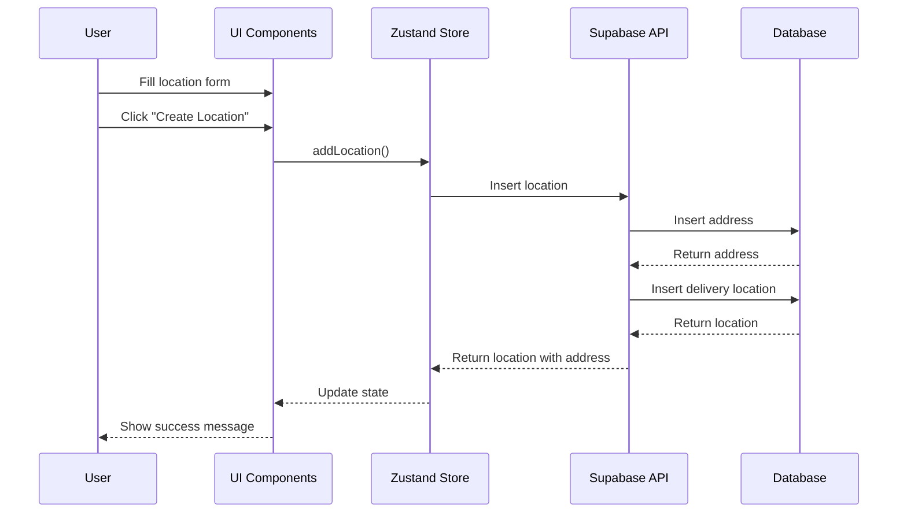
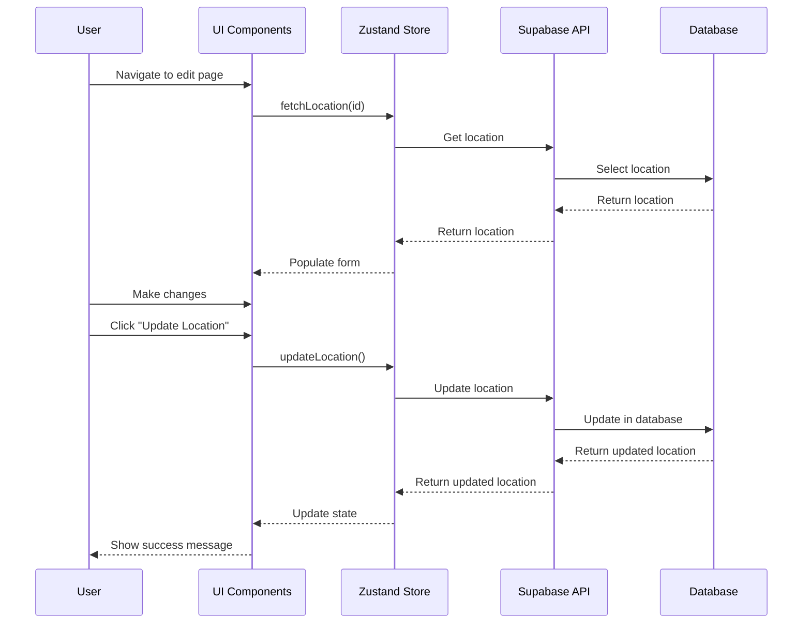

# Delivery Locations Implementation Plan

## Overview

This document outlines the implementation plan for the Delivery Locations management system, following the same pattern as the Product Management system. The Delivery Locations system allows administrators to create, read, update, and delete delivery locations with associated addresses and time windows.

## Data Model

### Core Entities

1. **Delivery Location**
   ```typescript
   interface DeliveryLocation {
     id: string;
     name: string;
     address: Address;
     start_open_time?: string;
     end_open_time?: string;
     provider_id: string;
     delivery_period_id?: string;
   }
   ```

2. **Address**
   ```typescript
   interface Address {
     id: string;
     name: string;
     address: string;
     address1?: string;
     city: string;
     state: string;
     zip: string;
     latitude?: number;
     longitude?: number;
   }
   ```

3. **Delivery Period**
   ```typescript
   interface DeliveryPeriod {
     id: string;
     start_date: string;
     end_date: string;
     title?: string;
     created_at: string;
     delivery_locations?: DeliveryLocation[];
   }
   ```

## State Management

### Zustand Store

The Delivery Locations store will manage the state for delivery locations:

```typescript
interface DeliveryLocationsState {
  locations: DeliveryLocation[];
  deliveryPeriods: DeliveryPeriod[];
  currentDeliveryPeriod: DeliveryPeriod | null;
  isLoading: boolean;
  error: Error | null;
  currentWeekStart: Date;
  currentWeekEnd: Date;
  fetchLocations: () => Promise<void>;
  addLocation: (location: Omit<DeliveryLocation, 'id'>) => Promise<DeliveryLocation | null>;
  updateLocation: (id: string, location: Partial<DeliveryLocation>) => Promise<DeliveryLocation | null>;
  deleteLocation: (id: string) => Promise<void>;
  addDeliveryPeriod: (period: Omit<DeliveryPeriod, 'id'>) => Promise<DeliveryPeriod | null>;
}
```

## Component Structure

### Pages

1. **Delivery Locations List Page**
   - Path: `/delivery-locations`
   - Features:
     - Display all delivery locations in a table
     - Filter and search functionality
     - Map view of locations
     - Actions for edit and delete

2. **Create Delivery Location Page**
   - Path: `/delivery-locations/create`
   - Features:
     - Form for entering location details
     - Address input with validation
     - Time window selection
     - Map for visual confirmation

3. **Edit Delivery Location Page**
   - Path: `/delivery-locations/edit/:id`
   - Features:
     - Pre-populated form with existing data
     - Address editing
     - Time window modification
     - Map for visual confirmation

### Components

1. **DeliveryLocationsTable**
   - Display locations in tabular format
   - Sorting and filtering capabilities
   - Action buttons for each row

2. **DeliveryLocationsMap**
   - Visual representation of locations on a map
   - Markers for each location
   - Info windows with location details

3. **DeliveryLocationForm**
   - Reusable form for creating and editing locations
   - Address input with validation
   - Time window selection
   - Provider selection

4. **AddressInput**
   - Specialized input for addresses
   - Validation for required fields
   - Optional geocoding integration

## API Integration

### Supabase Queries

1. **Fetch Locations**
   ```typescript
   const { data, error } = await supabase
     .from('delivery_location')
     .select(`
       *,
       address(*)
     `)
     .eq('delivery_period_id', periodId)
     .order('created_at', { ascending: false });
   ```

2. **Add Location**
   ```typescript
   const { data, error } = await supabase
     .from('delivery_location')
     .insert(locationToInsert)
     .select()
     .single();
   ```

3. **Update Location**
   ```typescript
   const { data, error } = await supabase
     .from('delivery_location')
     .update(locationToUpdate)
     .eq('id', id)
     .select()
     .single();
   ```

4. **Delete Location**
   ```typescript
   const { error } = await supabase
     .from('delivery_location')
     .delete()
     .eq('id', id);
   ```

## Form Validation

### Zod Schema

```typescript
export const deliveryLocationSchema = z.object({
  name: z.string().min(1, { message: "Location name is required." }),
  address: addressSchema,
  startOpenTime: z.string().optional(),
  endOpenTime: z.string().optional(),
  providerId: z.string().min(1, { message: "Provider is required." }),
  deliveryPeriodId: z.string().optional(),
});

export const addressSchema = z.object({
  name: z.string().min(1, { message: "Address name is required." }),
  address: z.string().min(1, { message: "Street address is required." }),
  address1: z.string().optional(),
  city: z.string().min(1, { message: "City is required." }),
  state: z.string().min(1, { message: "State is required." }),
  zip: z.string().min(1, { message: "ZIP code is required." }),
  latitude: z.number().optional(),
  longitude: z.number().optional(),
});
```

## Implementation Steps

### 1. Setup Data Models and Validation (1 day)
- Define TypeScript interfaces for all entities
- Create Zod validation schemas
- Set up type definitions for Supabase tables

### 2. Implement State Management (1 day)
- Create Zustand store for delivery locations
- Implement CRUD operations in the store
- Add error handling and loading states

### 3. Build UI Components (2 days)
- Create reusable form components
- Implement table and map views
- Build address input component with validation

### 4. Develop Pages (2 days)
- Create list page with table and map
- Implement create and edit pages
- Add navigation and routing

### 5. Add Map Integration (1 day)
- Integrate mapping library (Leaflet/Google Maps)
- Implement location markers
- Add geocoding for addresses

### 6. Testing and Refinement (1 day)
- Test all CRUD operations
- Verify form validation
- Ensure responsive design

## Flow Diagrams

### Create Delivery Location Flow



### Edit Delivery Location Flow



## Conclusion

This implementation plan provides a comprehensive approach to building the Delivery Locations management system following the same patterns as the Product Management system. By following this plan, we can ensure consistency across the application while providing a robust solution for managing delivery locations.