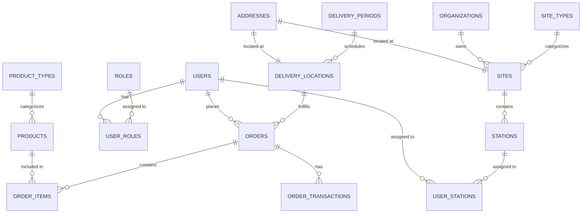
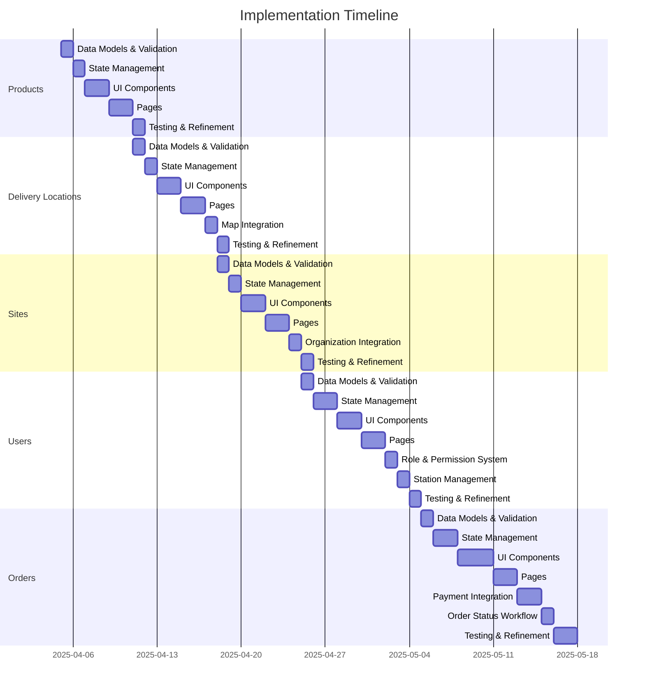

# Implementation Summary

## Overview

This document provides a comprehensive summary of the implementation plans for the core entities in our system: Products, Delivery Locations, Sites, Users, and Orders. Each entity follows a consistent architectural pattern, ensuring a cohesive and maintainable codebase.

## Architecture Pattern

All entities in the system follow the same architectural pattern:

1. **Data Model**: TypeScript interfaces defining the entity structure
2. **State Management**: Zustand stores for global state
3. **API Integration**: Supabase queries for database operations
4. **Form Validation**: Zod schemas for input validation
5. **UI Components**: Reusable React components
6. **Pages**: React Router pages for CRUD operations

This consistent pattern ensures:
- Predictable code structure
- Reusable patterns and components
- Consistent user experience
- Easier maintenance and onboarding

## Entity Relationships

The following diagram illustrates the relationships between the core entities:



## Implementation Timeline

The following Gantt chart outlines the implementation timeline for all entities:



## Common Components

Several components will be shared across multiple entities:

1. **AddressInput**: Used by both Delivery Locations and Sites
2. **ImageUploader**: Used by Products, Sites, and Users
3. **MarkdownEditor**: Used by Products and Sites
4. **SearchableSelect**: Used by all entities for relationship selection
5. **StatusBadge**: Used by Orders and Delivery Locations
6. **MapView**: Used by Delivery Locations and Sites
7. **FilterableTable**: Base table component used by all list views

## State Management Pattern

All Zustand stores follow a consistent pattern:

```typescript
interface EntityState {
  entities: Entity[];
  isLoading: boolean;
  error: Error | null;
  fetchEntities: () => Promise<void>;
  addEntity: (entity: EntityInput) => Promise<Entity | null>;
  updateEntity: (id: string, entity: Partial<EntityInput>) => Promise<Entity | null>;
  deleteEntity: (id: string) => Promise<void>;
  editingEntity: EditingEntity | null;
  setEditingEntity: (entity: EditingEntity) => void;
  getEditingEntity: (id: string) => EditingEntity | null;
  createEditingEntity: (entity: Entity) => EditingEntity;
}

interface EditingEntity {
  input: EntityInput;
  entity: Entity;
  is_dirty: boolean;
}
```

This pattern provides:
- Consistent state management across entities
- Temporary state for form editing
- Dirty state tracking for unsaved changes
- Error and loading state management

## Form Validation Pattern

All forms use Zod schemas for validation:

```typescript
export const entitySchema = z.object({
  name: z.string().min(1, { message: "Name is required." }),
  // Entity-specific fields
});

// Form component using the schema
const EntityForm = ({ defaultValues, onSubmit }) => {
  const form = useForm<EntityFormValues>({
    resolver: zodResolver(entitySchema),
    defaultValues,
  });
  
  return (
    <Form {...form}>
      <form onSubmit={form.handleSubmit(onSubmit)}>
        {/* Form fields */}
      </form>
    </Form>
  );
};
```

This pattern provides:
- Type-safe validation
- Consistent error messages
- Reusable validation logic

## API Integration Pattern

All API integrations use Supabase with a consistent pattern:

```typescript
// Fetch entities
const { data, error } = await supabase
  .from('entity_table')
  .select(`
    *,
    related_table(*)
  `)
  .order('created_at', { ascending: false });

// Add entity
const { data, error } = await supabase
  .from('entity_table')
  .insert(entityToInsert)
  .select()
  .single();

// Update entity
const { data, error } = await supabase
  .from('entity_table')
  .update(entityToUpdate)
  .eq('id', id)
  .select()
  .single();

// Delete entity
const { error } = await supabase
  .from('entity_table')
  .delete()
  .eq('id', id);
```

This pattern provides:
- Consistent database operations
- Predictable error handling
- Efficient relationship loading

## Testing Strategy

Each entity will be tested using the following approach:

1. **Unit Tests**: Test individual components and functions
2. **Integration Tests**: Test interactions between components
3. **End-to-End Tests**: Test complete user flows
4. **Accessibility Tests**: Ensure accessibility compliance
5. **Performance Tests**: Verify performance under load

## Deployment Strategy

The application will be deployed using a CI/CD pipeline:

1. **Development**: Local development environment
2. **Staging**: Automated deployment for testing
3. **Production**: Manual promotion from staging

## Conclusion

By following these consistent patterns across all entities, we ensure a cohesive and maintainable codebase. The implementation plans for Products, Delivery Locations, Sites, Users, and Orders provide a comprehensive roadmap for building the complete system.

Each entity's implementation plan contains detailed information about:
- Data models and relationships
- State management
- UI components
- API integration
- Form validation
- Implementation steps
- Flow diagrams

Together, these plans form a complete blueprint for implementing the system.