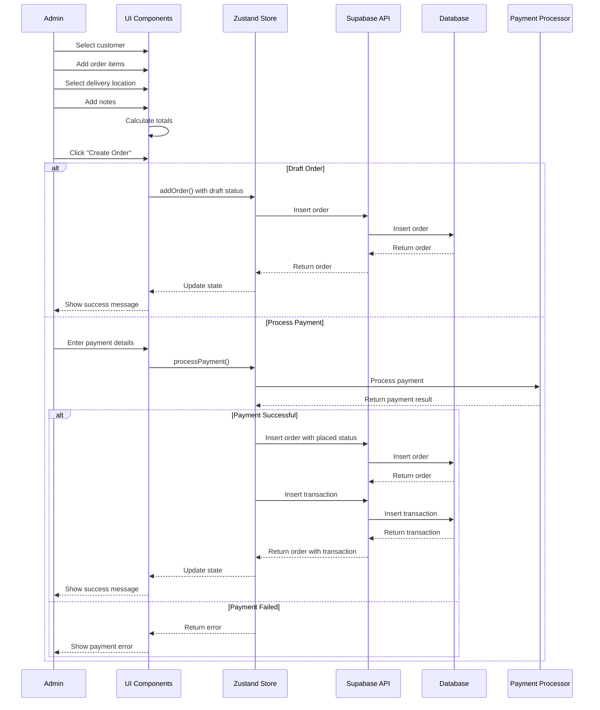
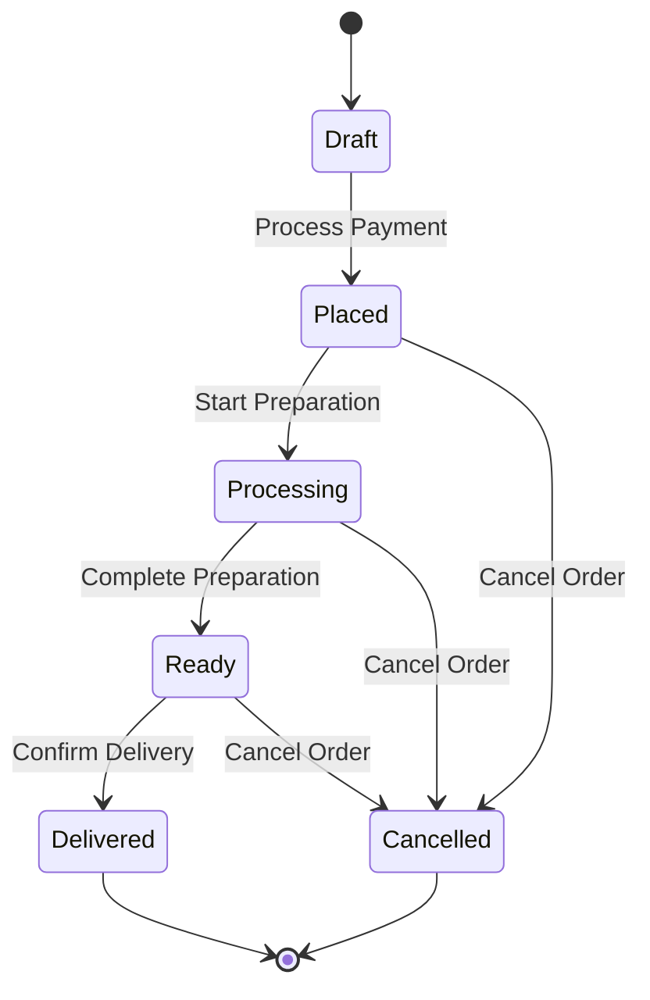

# Orders Implementation Plan

## Overview

This document outlines the implementation plan for the Orders management system, following the same pattern as the Product Management system. The Orders system allows administrators to create, read, update, and delete orders, manage order items, process payments, and track order status.

## Data Model

### Core Entities

1. **Order**
   ```typescript
   interface Order {
     id: string;
     order_status: OrderStatus;
     notes?: string;
     subtotal?: number;
     tax?: number;
     total?: number;
     created_at: string;
     updated_at?: string;
     delivery_location_id?: string;
     delivery_location?: DeliveryLocation;
     user_id: string;
     user: User;
     order_items: OrderItem[];
     transactions?: OrderTransaction[];
   }
   ```

2. **OrderItem**
   ```typescript
   interface OrderItem {
     id: string;
     order_id: string;
     product_id?: string;
     product?: Product;
     quantity: number;
     unit_price: number;
     notes?: string;
     created_at: string;
   }
   ```

3. **OrderTransaction**
   ```typescript
   interface OrderTransaction {
     id: string;
     order_id: string;
     amount: number;
     cc_card: string;
     cc_last4: string;
     payer_transaction_id?: string;
     succeeded: boolean;
     error?: string;
     data?: Record<string, unknown>;
     created_at: string;
   }
   ```

4. **OrderStatus** (Enum)
   ```typescript
   enum OrderStatus {
     DRAFT = 'draft',
     PLACED = 'placed',
     PROCESSING = 'processing',
     READY = 'ready',
     DELIVERED = 'delivered',
     CANCELLED = 'cancelled'
   }
   ```

## State Management

### Zustand Store

The Orders store will manage the state for orders:

```typescript
interface OrderStoreState {
  orders: Order[];
  isLoading: boolean;
  error: Error | null;
  fetchOrders: () => Promise<void>;
  fetchOrderById: (id: string) => Promise<Order | null>;
  addOrder: (order: OrderInput) => Promise<Order | null>;
  updateOrder: (id: string, order: Partial<OrderInput>) => Promise<Order | null>;
  updateOrderStatus: (id: string, status: OrderStatus) => Promise<Order | null>;
  deleteOrder: (id: string) => Promise<void>;
  addOrderItem: (orderId: string, item: OrderItemInput) => Promise<OrderItem | null>;
  updateOrderItem: (id: string, item: Partial<OrderItemInput>) => Promise<OrderItem | null>;
  removeOrderItem: (id: string) => Promise<void>;
  processPayment: (orderId: string, paymentDetails: PaymentDetails) => Promise<OrderTransaction | null>;
  calculateOrderTotals: (orderId: string) => Promise<{ subtotal: number, tax: number, total: number }>;
  draftOrder: OrderDraft | null;
  setDraftOrder: (draft: OrderDraft) => void;
  clearDraftOrder: () => void;
}

interface OrderInput {
  order_status: OrderStatus;
  notes?: string;
  delivery_location_id?: string;
  user_id: string;
  order_items: OrderItemInput[];
}

interface OrderItemInput {
  product_id?: string;
  quantity: number;
  unit_price: number;
  notes?: string;
}

interface OrderDraft {
  input: OrderInput;
  is_dirty: boolean;
}

interface PaymentDetails {
  card_number: string;
  expiry_month: number;
  expiry_year: number;
  cvc: string;
  billing_details: {
    name: string;
    address: {
      line1: string;
      line2?: string;
      city: string;
      state: string;
      postal_code: string;
      country: string;
    }
  }
}
```

## Component Structure

### Pages

1. **Orders List Page**
   - Path: `/orders`
   - Features:
     - Display all orders in a table
     - Filter by status, date, and customer
     - Search functionality
     - Actions for view, edit, and delete

2. **Create Order Page**
   - Path: `/orders/create`
   - Features:
     - Customer selection
     - Product selection and quantity
     - Delivery location selection
     - Notes and special instructions
     - Order summary with totals
     - Payment processing

3. **Edit Order Page**
   - Path: `/orders/edit/:id`
   - Features:
     - Update order items
     - Change delivery location
     - Update status
     - Add notes
     - Process additional payments

4. **Order Details Page**
   - Path: `/orders/:id`
   - Features:
     - Comprehensive order information
     - Customer details
     - Order items with prices
     - Payment history
     - Status updates
     - Delivery information

### Components

1. **OrdersTable**
   - Display orders in tabular format
   - Status indicators with colors
   - Sorting and filtering capabilities
   - Action buttons for each row

2. **OrderForm**
   - Reusable form for creating and editing orders
   - Customer selection component
   - Product selection with quantity inputs
   - Delivery location selection
   - Notes and special instructions

3. **OrderItemsManager**
   - Add, edit, and remove order items
   - Product search and selection
   - Quantity adjustment
   - Price calculation
   - Subtotal display

4. **PaymentProcessor**
   - Credit card input form
   - Payment processing status
   - Transaction history
   - Receipt generation

5. **OrderStatusManager**
   - Status update interface
   - Status history timeline
   - Status-specific actions
   - Notification triggers

## API Integration

### Supabase Queries

1. **Fetch Orders**
   ```typescript
   const { data, error } = await supabase
     .from('orders')
     .select(`
       *,
       delivery_location (
         *,
         address(*)
       ),
       users (*),
       order_items (
         *,
         products(*)
       ),
       order_transactions(*)
     `)
     .order('created_at', { ascending: false });
   ```

2. **Add Order**
   ```typescript
   const { data, error } = await supabase
     .from('orders')
     .insert(orderToInsert)
     .select(`
       *,
       delivery_location (
         *,
         address(*)
       ),
       users (*),
       order_items (*)
     `)
     .single();
   ```

3. **Update Order**
   ```typescript
   const { data, error } = await supabase
     .from('orders')
     .update(orderToUpdate)
     .eq('id', id)
     .select(`
       *,
       delivery_location (
         *,
         address(*)
       ),
       users (*),
       order_items (*)
     `)
     .single();
   ```

4. **Delete Order**
   ```typescript
   const { error } = await supabase
     .from('orders')
     .delete()
     .eq('id', id);
   ```

5. **Add Order Item**
   ```typescript
   const { data, error } = await supabase
     .from('order_items')
     .insert({
       order_id: orderId,
       product_id: item.product_id,
       quantity: item.quantity,
       unit_price: item.unit_price,
       notes: item.notes,
     })
     .select(`
       *,
       products(*)
     `)
     .single();
   ```

6. **Process Payment**
   ```typescript
   // This would typically involve a server-side function or API endpoint
   // that communicates with a payment processor like Stripe
   const { data, error } = await supabase
     .from('order_transactions')
     .insert({
       order_id: orderId,
       amount: amount,
       cc_card: paymentDetails.card_number.substring(0, 6),
       cc_last4: paymentDetails.card_number.substring(paymentDetails.card_number.length - 4),
       succeeded: true,
       data: { billing_details: paymentDetails.billing_details },
     })
     .select()
     .single();
   ```

## Form Validation

### Zod Schema

```typescript
export const orderSchema = z.object({
  orderStatus: z.enum(['draft', 'placed', 'processing', 'ready', 'delivered', 'cancelled']),
  notes: z.string().optional(),
  deliveryLocationId: z.string().optional(),
  userId: z.string().min(1, { message: "Customer is required." }),
  orderItems: z.array(
    z.object({
      productId: z.string().optional(),
      quantity: z.number().min(1, { message: "Quantity must be at least 1." }),
      unitPrice: z.number().min(0, { message: "Price must be a positive number." }),
      notes: z.string().optional(),
    })
  ).min(1, { message: "At least one item is required." }),
});

export const paymentSchema = z.object({
  cardNumber: z.string().min(13, { message: "Invalid card number." }).max(19),
  expiryMonth: z.number().min(1).max(12),
  expiryYear: z.number().min(new Date().getFullYear() % 100),
  cvc: z.string().min(3).max(4),
  billingDetails: z.object({
    name: z.string().min(1, { message: "Name is required." }),
    address: z.object({
      line1: z.string().min(1, { message: "Address line 1 is required." }),
      line2: z.string().optional(),
      city: z.string().min(1, { message: "City is required." }),
      state: z.string().min(1, { message: "State is required." }),
      postalCode: z.string().min(1, { message: "Postal code is required." }),
      country: z.string().min(1, { message: "Country is required." }),
    }),
  }),
});
```

## Implementation Steps

### 1. Setup Data Models and Validation (1 day)
- Define TypeScript interfaces for all entities
- Create Zod validation schemas
- Set up type definitions for Supabase tables
- Define order status workflow

### 2. Implement State Management (2 days)
- Create Zustand store for orders
- Implement CRUD operations in the store
- Add order item management functions
- Implement payment processing
- Add error handling and loading states

### 3. Build UI Components (3 days)
- Create reusable form components
- Implement table view with filtering
- Build order item management component
- Create payment processing component
- Implement order status management

### 4. Develop Pages (2 days)
- Create list page with table
- Implement create and edit pages
- Add order details page
- Add navigation and routing

### 5. Add Payment Integration (2 days)
- Implement secure payment form
- Add Stripe integration
- Create transaction recording
- Implement receipt generation

### 6. Add Order Status Workflow (1 day)
- Implement status update interface
- Create status-specific actions
- Add notification triggers
- Implement status history

### 7. Testing and Refinement (2 days)
- Test all CRUD operations
- Verify form validation
- Test payment processing
- Ensure responsive design
- Test order workflow

## Flow Diagrams

### Create Order Flow



### Order Status Workflow



## Payment Processing

The order management system will integrate with Stripe for payment processing:

1. **Secure Form**: PCI-compliant credit card form
2. **Payment Intent**: Create a payment intent on the server
3. **Client Confirmation**: Confirm payment on the client
4. **Transaction Recording**: Store transaction details in the database
5. **Receipt Generation**: Generate and send receipt to customer

### Stripe Integration

```typescript
// Server-side function (would be implemented as a Supabase Edge Function)
export async function createPaymentIntent(orderId: string, amount: number) {
  const stripe = new Stripe(process.env.STRIPE_SECRET_KEY);
  
  const paymentIntent = await stripe.paymentIntents.create({
    amount: Math.round(amount * 100), // Convert to cents
    currency: 'usd',
    metadata: { orderId },
  });
  
  return { clientSecret: paymentIntent.client_secret };
}

// Client-side payment processing
async function processPayment(orderId: string, amount: number, paymentDetails: PaymentDetails) {
  // Get client secret from server
  const { clientSecret } = await createPaymentIntent(orderId, amount);
  
  // Confirm payment with Stripe.js
  const stripe = await loadStripe(process.env.STRIPE_PUBLISHABLE_KEY);
  const result = await stripe.confirmCardPayment(clientSecret, {
    payment_method: {
      card: {
        number: paymentDetails.card_number,
        exp_month: paymentDetails.expiry_month,
        exp_year: paymentDetails.expiry_year,
        cvc: paymentDetails.cvc,
      },
      billing_details: paymentDetails.billing_details,
    },
  });
  
  if (result.error) {
    throw new Error(result.error.message);
  }
  
  // Record transaction in database
  return recordTransaction(orderId, amount, paymentDetails, result.paymentIntent.id);
}
```

## Order Reporting

The order management system will include reporting capabilities:

1. **Sales Reports**: Daily, weekly, and monthly sales
2. **Product Reports**: Best-selling products and revenue by product
3. **Customer Reports**: Orders by customer and customer spending
4. **Status Reports**: Orders by status and processing times
5. **Delivery Reports**: Orders by delivery location and delivery times

### Report Generation

```typescript
// Example of a sales report function
async function generateSalesReport(startDate: Date, endDate: Date) {
  const { data, error } = await supabase
    .from('orders')
    .select(`
      id,
      total,
      created_at,
      order_status,
      order_items (
        quantity,
        unit_price,
        products(name)
      )
    `)
    .gte('created_at', startDate.toISOString())
    .lte('created_at', endDate.toISOString())
    .not('order_status', 'eq', 'cancelled');
    
  if (error) throw error;
  
  // Process data for report
  const totalSales = data.reduce((sum, order) => sum + (order.total || 0), 0);
  const orderCount = data.length;
  const averageOrderValue = totalSales / orderCount;
  
  // Group by day
  const salesByDay = {};
  data.forEach(order => {
    const day = order.created_at.substring(0, 10);
    salesByDay[day] = (salesByDay[day] || 0) + (order.total || 0);
  });
  
  return {
    totalSales,
    orderCount,
    averageOrderValue,
    salesByDay,
  };
}
```

## Conclusion

This implementation plan provides a comprehensive approach to building the Orders management system following the same patterns as the Product Management system. The plan includes payment processing, order status workflow, and reporting capabilities, allowing for a complete order management solution.