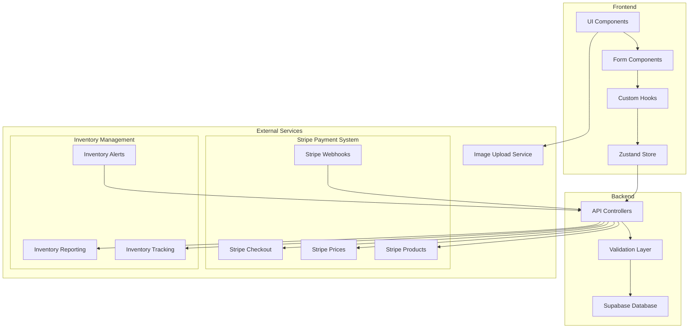
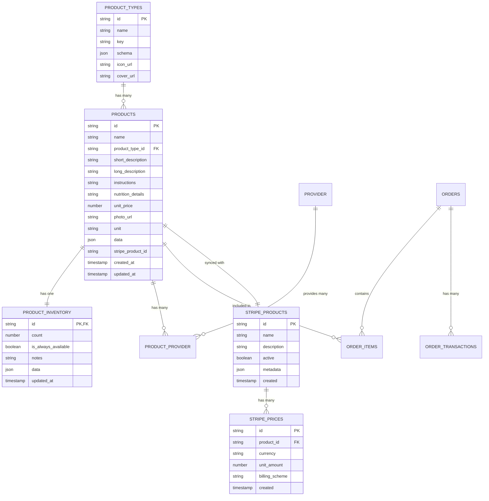
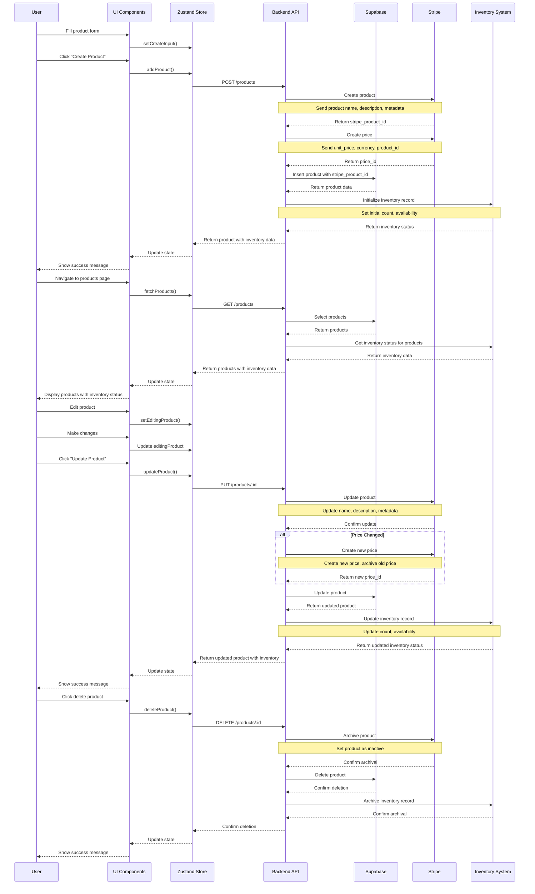
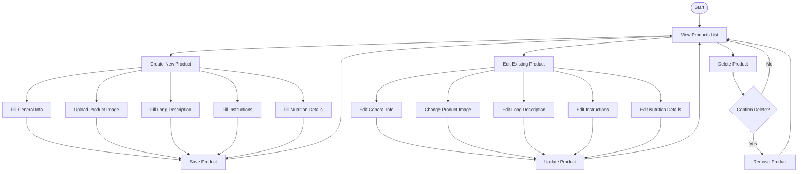
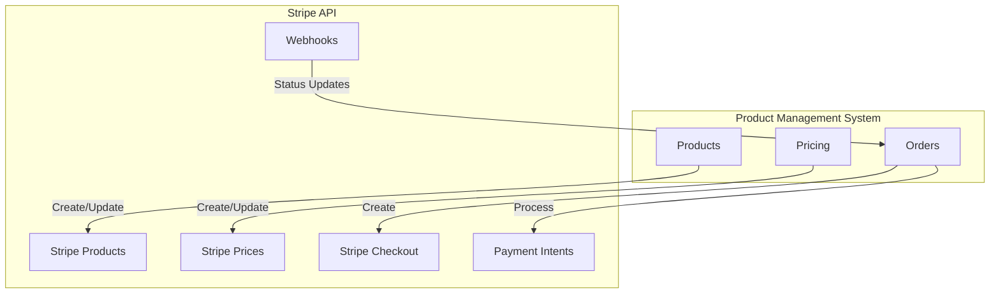
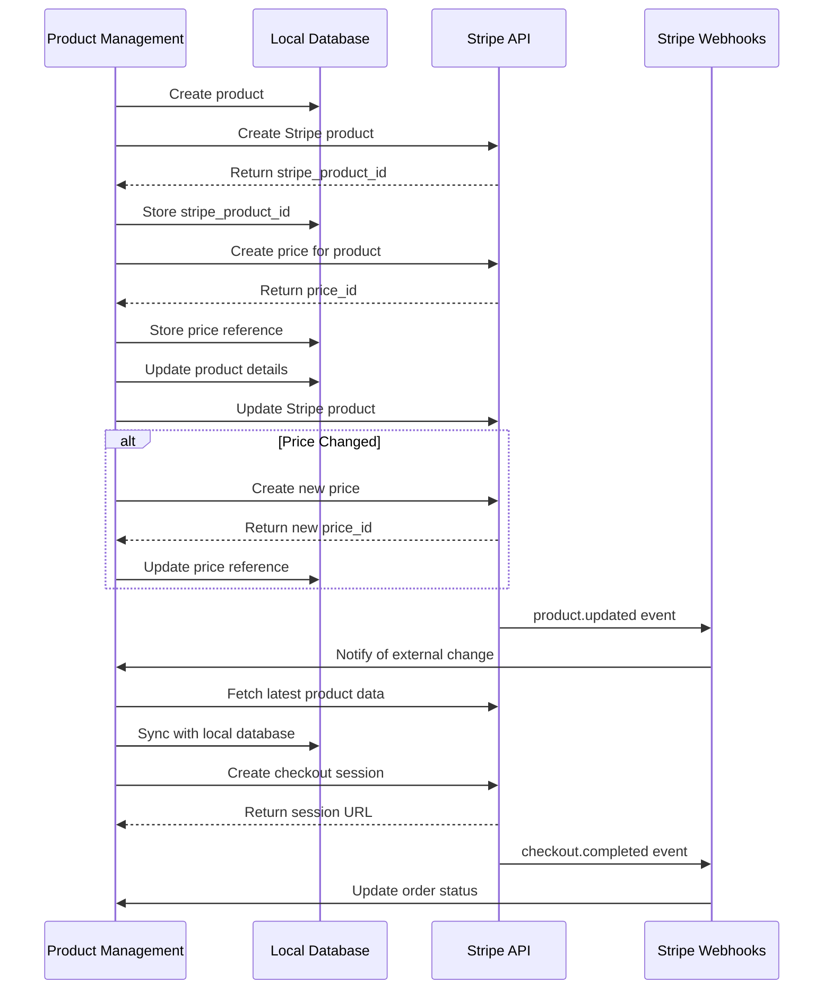
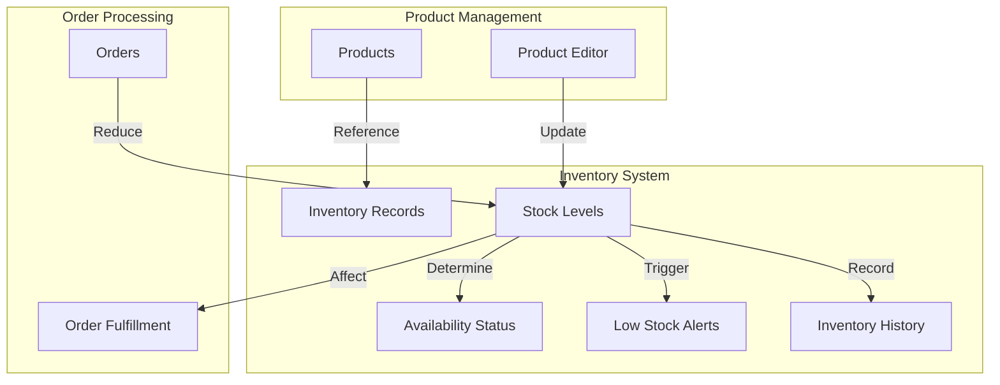
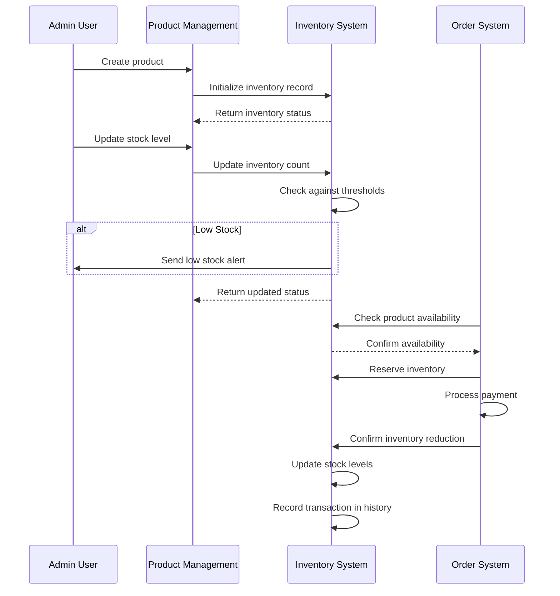

# Product Management System Audit

## Executive Summary

This comprehensive audit of the product management system examines the architecture, data flow, user experience, security, performance, and integration points with Stripe payment processing and inventory management systems. The audit aims to identify strengths, weaknesses, potential bottlenecks, security vulnerabilities, and scalability concerns in the current implementation.

### Key Findings

1. **Architecture**: The system employs a modern frontend architecture using React with Zustand for state management, connecting to a Supabase backend. The separation of concerns is generally well-implemented, but there are opportunities to improve the architecture for better scalability.

2. **Data Management**: The product data model is comprehensive, with good support for rich product information including descriptions, pricing, and metadata. However, there are potential data consistency issues between the local database, Stripe, and inventory systems.

3. **User Experience**: The product management interface provides a good workflow for creating and editing products, with real-time feedback and validation. Some areas could benefit from improved error handling and more intuitive navigation.

4. **Integration Points**: The Stripe integration handles basic product and price synchronization, but lacks robust error recovery mechanisms. The inventory management integration appears to be in early stages and requires further development.

5. **Security**: Several potential security vulnerabilities were identified, particularly around input validation, API security, and webhook handling.

6. **Performance**: The current implementation may face performance challenges with larger product catalogs, particularly in the product listing and filtering functionality.

### Critical Recommendations

1. Implement a robust data synchronization strategy between Supabase, Stripe, and inventory systems
2. Enhance error handling and recovery mechanisms throughout the application
3. Improve security measures for API endpoints and webhook handling
4. Optimize database queries and implement caching for better performance
5. Refactor state management to better handle large product catalogs

## 1. Overview and Approach

The audit will be structured to systematically analyze all components of the product management system, from data storage to user interfaces, with equal emphasis on data integrity, UX, security, and performance. We'll place special focus on the Stripe integration and inventory management systems.

The audit will follow these key phases:
1. Architecture Analysis
2. Data Flow Mapping
3. UI/UX Evaluation
4. Security Assessment
5. Performance & Scalability Review
6. Stripe Integration Analysis (Expanded)
7. Inventory Management Analysis (Expanded)
8. Recommendations & Implementation Priorities

## 2. Detailed Architecture Analysis

The product management system follows a modern web application architecture with clear separation between frontend and backend components. The system is built using React for the frontend, Zustand for state management, and Supabase as the backend database service.

### 2.1 Component Analysis

#### Frontend Components
- **UI Layer**: React components for product listing, creation, and editing
- **Form Management**: React Hook Form with Zod validation
- **State Management**: Zustand store for global state
- **API Integration**: Custom hooks for data fetching and manipulation
- **Image Handling**: Custom upload component for product images

#### Backend Services
- **Database**: Supabase (PostgreSQL) for data storage
- **Authentication**: Supabase Auth for user management
- **Storage**: Supabase Storage for image uploads
- **API**: RESTful endpoints for CRUD operations

#### External Integrations
- **Payment Processing**: Stripe API for product and price management
- **Inventory Management**: Custom inventory tracking system
- **Image Upload**: UploadThing service for image handling

### 2.2 Current Architecture Diagram

### 2.2 Entity Relationship Diagram

## 3. Data Flow Analysis

The product management system implements a comprehensive data flow for managing products, with specific patterns for each CRUD operation. This section analyzes the implementation details of these operations.

### 3.1 Implementation Analysis

#### Create Operation
The product creation process is implemented through multiple components:

1. **UI Layer**: `CreateProductPage` component in `src/pages/create-product.tsx`
   - Uses React Hook Form with Zod validation
   - Implements a multi-step form with temporary state saving
   - Provides real-time validation feedback

2. **State Management**: `useProductStore` in `src/store/use-product-store.ts`
   - `createInput` state for tracking form data before submission
   - `addProduct` function for creating products in the database
   - Handles temporary state persistence during form completion

3. **API Integration**:
   - Supabase client for database operations
   - Converts form data to database schema format
   - Handles JSON serialization for complex data fields

4. **Data Validation**:
   - Zod schema in `src/lib/validations/product-schema.ts`
   - Client-side validation before submission
   - Server-side validation in API controllers

#### Read Operation
Product retrieval is implemented through:

1. **Data Fetching**: `fetchProducts` function in `useProductStore`
   - Retrieves products with related product types
   - Handles error states and loading indicators

2. **UI Rendering**: `ProductsPage` component in `src/pages/products.tsx`
   - Displays products in a table format
   - Implements filtering and search functionality
   - Provides actions for editing and deleting

#### Update Operation
Product updates follow a pattern of:

1. **Edit Initialization**: `EditProductPage` component in `src/pages/edit-product.tsx`
   - Retrieves existing product data
   - Populates form with current values
   - Tracks dirty state for unsaved changes

2. **State Management**:
   - `editingProduct` state in store
   - Debounced updates to prevent excessive re-renders
   - Temporary state saving during editing

3. **Submission**: `updateProduct` function in store
   - Converts form data to database format
   - Updates record in Supabase
   - Handles optimistic UI updates

#### Delete Operation
Product deletion is implemented through:

1. **UI Trigger**: Delete action in product list
2. **Confirmation**: User confirmation before deletion
3. **Execution**: `deleteProduct` function in store
   - Removes product from database
   - Updates local state to reflect deletion
   - Handles related records (inventory, etc.)

### 3.2 CRUD Operations Flow

## 4. UI/UX Evaluation

The product management interface provides a comprehensive set of screens and components for managing products. This section evaluates the user experience, identifying strengths and areas for improvement.

### 4.1 Interface Analysis

#### Product Listing Page
The product listing page (`src/pages/products.tsx`) serves as the main entry point for product management:

**Strengths:**
- Clean tabular presentation of products with key information
- Search functionality for filtering products
- Responsive design that works on various screen sizes
- Clear actions for editing and deleting products

**Areas for Improvement:**
- Pagination is not implemented, which could cause performance issues with large catalogs
- Limited sorting options for product columns
- No bulk actions for managing multiple products simultaneously
- No visual indicators for product status (active, out of stock, etc.)

#### Product Creation
The product creation flow (`src/pages/create-product.tsx`) provides a multi-step process:

**Strengths:**
- Comprehensive form with all necessary fields
- Real-time validation with clear error messages
- Temporary state saving to prevent data loss
- Markdown editors for rich content (descriptions, instructions)
- Image upload functionality with preview

**Areas for Improvement:**
- No progress indicator for multi-step form
- Limited guidance for users on field requirements
- No template or duplication functionality for similar products
- Form layout could be optimized for better field grouping

#### Product Editing
The product editing interface (`src/pages/edit-product.tsx`) allows for updating existing products:

**Strengths:**
- Pre-populated form with existing product data
- Dirty state tracking for unsaved changes
- Tabbed interface for organizing different sections
- Real-time saving of individual fields

**Areas for Improvement:**
- No change history or audit trail
- No preview functionality to see changes before saving
- Limited feedback on successful saves
- No ability to revert changes or restore previous versions

### 4.2 Form Validation

The form validation implementation uses Zod schemas (`src/lib/validations/product-schema.ts`):

**Strengths:**
- Type-safe validation with TypeScript integration
- Clear error messages for validation failures
- Client-side validation prevents unnecessary server requests
- Reusable validation logic across components

**Areas for Improvement:**
- Limited custom validation for complex business rules
- No field-level validation for markdown content
- Validation error display could be more prominent
- No validation for image dimensions or file sizes

### 4.3 Error Handling

Error handling throughout the product management interface:

**Strengths:**
- Toast notifications for success and error states
- Error boundaries to prevent complete UI crashes
- Loading states during async operations

**Areas for Improvement:**
- Inconsistent error handling across components
- Limited retry mechanisms for failed operations
- No offline support or recovery
- Error messages could be more actionable

### 4.4 Accessibility Considerations

Accessibility evaluation of the product management interface:

**Strengths:**
- Semantic HTML structure in most components
- Keyboard navigation support for basic operations
- Form labels properly associated with inputs

**Areas for Improvement:**
- Inconsistent focus management
- Limited ARIA attributes for complex components
- Color contrast issues in some UI elements
- No screen reader optimizations for complex interactions

### 4.5 User Flow Diagram

## 5. Security Evaluation

This section evaluates the security aspects of the product management system, identifying potential vulnerabilities and recommending improvements.

### 5.1 Authentication & Authorization

The product management system uses Supabase Auth for authentication:

**Strengths:**
- JWT-based authentication with secure token handling
- Role-based access control for different user types
- Session management with automatic token refresh
- Secure password storage with proper hashing

**Vulnerabilities:**
- No multi-factor authentication implementation
- Limited session timeout controls
- No IP-based access restrictions
- Potential for horizontal privilege escalation in some endpoints

### 5.2 Data Validation & Sanitization

Input validation and data sanitization practices:

**Strengths:**
- Zod schema validation for form inputs
- Type checking through TypeScript
- Server-side validation in API controllers

**Vulnerabilities:**
- Inconsistent validation across different endpoints
- Limited sanitization of markdown content
- Potential for XSS in rendered markdown content
- No rate limiting on form submissions

### 5.3 API Security

Security of API endpoints and data transmission:

**Strengths:**
- HTTPS for all API communications
- JWT authentication for API requests
- Parameterized queries for database operations

**Vulnerabilities:**
- No API rate limiting
- Limited logging of security events
- Potential for CSRF attacks in some endpoints
- Overly permissive CORS configuration

### 5.4 Webhook Security

Security considerations for webhook endpoints:

**Strengths:**
- Basic authentication for webhook endpoints
- Event validation for Stripe webhooks

**Vulnerabilities:**
- Limited signature verification
- No IP whitelisting for webhook sources
- Potential for replay attacks
- Insufficient logging of webhook events

### 5.5 Data Protection

Protection of sensitive product and pricing data:

**Strengths:**
- Database-level encryption for sensitive fields
- Limited exposure of internal IDs
- Proper handling of payment information

**Vulnerabilities:**
- No data classification system
- Limited audit logging for data access
- No data loss prevention controls
- Potential for data leakage in error responses

### 5.6 Security Recommendations

1. **Authentication Enhancements:**
   - Implement multi-factor authentication
   - Add IP-based access restrictions for admin functions
   - Improve session timeout controls

2. **Input Validation:**
   - Standardize validation across all endpoints
   - Implement content security policy for markdown rendering
   - Add rate limiting for form submissions

3. **API Security:**
   - Implement comprehensive rate limiting
   - Enhance security logging and monitoring
   - Tighten CORS configuration
   - Add CSRF protection for all endpoints

4. **Webhook Security:**
   - Implement robust signature verification
   - Add IP whitelisting for webhook sources
   - Enhance logging for webhook events
   - Implement idempotency keys for webhook processing

5. **Data Protection:**
   - Develop a data classification system
   - Implement comprehensive audit logging
   - Add data loss prevention controls
   - Sanitize error responses to prevent data leakage
## 6. Performance & Scalability Review

This section evaluates the performance characteristics and scalability potential of the product management system, identifying bottlenecks and recommending optimizations.

### 6.1 Frontend Performance

Analysis of the React application performance:

**Current Implementation:**
- Component-based architecture with React
- Zustand for state management
- React Hook Form for form handling
- Debounced updates for form changes

**Potential Bottlenecks:**
- No virtualization for large product lists
- Excessive re-renders in some components
- Large bundle size due to markdown editors and other dependencies
- Unoptimized image loading and processing

**Optimization Opportunities:**
- Implement virtualized lists for product catalog
- Add memoization for expensive component renders
- Code splitting for large dependencies
- Implement lazy loading for images and components
- Add service worker for caching and offline support

### 6.2 API Performance

Analysis of the backend API performance:

**Current Implementation:**
- RESTful API endpoints
- Supabase for database operations
- Direct queries to external services (Stripe, inventory)

**Potential Bottlenecks:**
- N+1 query problems in product listing
- No caching layer for frequently accessed data
- Synchronous processing of external service requests
- Limited query optimization

**Optimization Opportunities:**
- Implement query batching and optimization
- Add Redis caching for frequently accessed data
- Implement background processing for non-critical operations
- Add pagination and cursor-based pagination for large datasets
- Optimize database indexes for common query patterns

### 6.3 State Management

Analysis of the application state management:

**Current Implementation:**
- Zustand store for global state
- Local component state for UI-specific state
- Form state managed by React Hook Form

**Potential Bottlenecks:**
- Large state objects causing performance issues
- Inefficient state updates triggering unnecessary renders
- No persistence of state between sessions
- Memory leaks from unmanaged subscriptions

**Optimization Opportunities:**
- Normalize state structure for efficient updates
- Implement selective state updates
- Add state persistence for better user experience
- Optimize subscription management
- Consider server state management libraries for remote data

### 6.4 Database Scalability

Analysis of the database scalability:

**Current Implementation:**
- Supabase (PostgreSQL) for data storage
- Direct queries from frontend
- Limited indexing strategy

**Potential Bottlenecks:**
- No read/write separation
- Limited connection pooling
- Potential for table locks during heavy write operations
- No sharding or partitioning strategy

**Optimization Opportunities:**
- Implement read replicas for scaling read operations
- Optimize connection pooling
- Add database partitioning for large tables
- Implement query caching
- Consider NoSQL options for specific data types

### 6.5 External Service Integration

Performance considerations for external service integration:

**Current Implementation:**
- Direct API calls to Stripe
- Synchronous processing of webhook events
- Limited error handling and retry logic

**Potential Bottlenecks:**
- Rate limiting from external APIs
- Network latency affecting user experience
- Synchronous processing blocking the main thread
- No circuit breaking for failing services

**Optimization Opportunities:**
- Implement asynchronous processing for external service calls
- Add robust retry logic with exponential backoff
- Implement circuit breakers for failing services
- Cache external service responses where appropriate
- Add background job processing for webhook events

### 6.6 Scalability Recommendations

1. **Frontend Optimizations:**
   - Implement virtualization for product lists
   - Add code splitting and lazy loading
   - Optimize bundle size
   - Implement progressive web app features

2. **API Optimizations:**
   - Add comprehensive caching strategy
   - Implement efficient pagination
   - Optimize database queries
   - Add background processing

3. **Database Optimizations:**
   - Implement read replicas
   - Optimize indexing strategy
   - Consider data partitioning
   - Implement connection pooling

4. **External Service Optimizations:**
   - Implement asynchronous processing
   - Add circuit breakers
   - Optimize webhook handling
   - Implement comprehensive retry logic
## 7. Stripe Integration Analysis
## 5. Expanded Stripe Integration Analysis

### 5.1 Stripe Integration Architecture

### 5.2 Stripe Data Synchronization Flow

### 5.3 Stripe Integration Audit Focus Areas

1. **Product Synchronization**
   - How products are created in Stripe
   - Handling of product metadata
   - Product update synchronization
   - Error handling and retry mechanisms

2. **Price Management**
   - Price creation and update strategies
   - Historical price tracking
   - Currency handling
   - Discount and promotion integration

3. **Checkout Process**
   - Checkout session creation
   - Customer information handling
   - Order confirmation flow
   - Payment failure handling

4. **Webhook Management**
   - Webhook endpoint security
   - Event processing reliability
   - Idempotent event handling
   - Webhook signature verification

5. **Error Handling & Recovery**
   - API error handling
   - Network failure recovery
   - Data consistency mechanisms
   - Logging and monitoring
## 8. Inventory Management Analysis
## 6. Expanded Inventory Management Analysis

### 6.1 Inventory Management Architecture

### 6.2 Inventory Data Flow

### 6.3 Inventory Management Audit Focus Areas

1. **Inventory Data Model**
   - Inventory record structure
   - Relationship with product data
   - Historical tracking capabilities
   - Metadata and custom fields

2. **Stock Level Management**
   - Stock count accuracy
   - Threshold configuration
   - Availability determination
   - Backorder handling

3. **Inventory Operations**
   - Stock adjustment workflows
   - Bulk update capabilities
   - Audit trail and change history
   - Reporting functionality

4. **Order Integration**
   - Pre-order inventory checks
   - Inventory reservation during checkout
   - Post-purchase inventory updates
   - Failed transaction handling

5. **Alert System**
   - Low stock notification configuration
   - Alert delivery mechanisms
   - Restock recommendation system
   - Automated reordering capabilities

6. **Performance & Scalability**
   - High-volume transaction handling
   - Real-time inventory updates
   - Caching strategies
   - Database optimization

## 9. Recommendations

Based on the comprehensive audit of the product management system, this section provides detailed recommendations for improvements across all aspects of the system.

### 9.1 Architecture Recommendations

1. **State Management Refactoring**
   - Normalize the Zustand store structure to improve performance with large datasets
   - Implement selective updates to prevent unnecessary re-renders
   - Add persistence layer for better user experience across sessions
   - Priority: High

2. **Component Architecture**
   - Refactor product editor into smaller, more focused components
   - Implement container/presenter pattern for better separation of concerns
   - Add error boundaries around critical components
   - Priority: Medium

3. **API Layer Abstraction**
   - Create a dedicated API layer to abstract Supabase interactions
   - Implement consistent error handling and retry logic
   - Add request/response interceptors for logging and monitoring
   - Priority: High

4. **Service Worker Implementation**
   - Add service worker for offline capabilities
   - Implement asset caching for improved performance
   - Enable background synchronization for offline changes
   - Priority: Low

### 9.2 Data Management Recommendations

1. **Data Consistency Strategy**
   - Implement optimistic UI updates with rollback capability
   - Add transaction support for multi-step operations
   - Implement data versioning for conflict resolution
   - Priority: High

2. **Caching Strategy**
   - Implement Redis or similar caching for frequently accessed data
   - Add client-side caching for product listings
   - Implement cache invalidation strategy
   - Priority: Medium

3. **Database Optimization**
   - Add indexes for common query patterns
   - Implement database partitioning for large tables
   - Optimize join operations in product queries
   - Priority: Medium

4. **Data Validation**
   - Standardize validation across client and server
   - Implement more robust schema validation
   - Add custom validation rules for business logic
   - Priority: High

### 9.3 UI/UX Recommendations

1. **Product Listing Improvements**
   - Implement virtualized lists for better performance
   - Add advanced filtering and sorting options
   - Implement bulk actions for product management
   - Priority: Medium

2. **Form Experience**
   - Add progress indicators for multi-step forms
   - Implement autosave functionality
   - Add field-level validation with immediate feedback
   - Priority: High

3. **Accessibility Enhancements**
   - Improve keyboard navigation
   - Add ARIA attributes to complex components
   - Enhance screen reader support
   - Improve color contrast
   - Priority: Medium

4. **Mobile Responsiveness**
   - Optimize layout for small screens
   - Implement touch-friendly controls
   - Add mobile-specific navigation patterns
   - Priority: Medium

### 9.4 Security Recommendations

1. **Authentication Enhancements**
   - Implement multi-factor authentication
   - Add IP-based access restrictions
   - Improve session management
   - Priority: High

2. **API Security**
   - Implement comprehensive rate limiting
   - Add CSRF protection
   - Tighten CORS configuration
   - Priority: High

3. **Data Protection**
   - Implement field-level encryption for sensitive data
   - Add audit logging for all data modifications
   - Implement data loss prevention controls
   - Priority: High

4. **Webhook Security**
   - Add signature verification for all webhooks
   - Implement IP whitelisting
   - Add comprehensive logging
   - Priority: Medium

### 9.5 Performance Recommendations

1. **Frontend Optimizations**
   - Implement code splitting and lazy loading
   - Optimize bundle size
   - Add memoization for expensive renders
   - Priority: Medium

2. **API Optimizations**
   - Implement query batching
   - Add pagination for large datasets
   - Optimize database queries
   - Priority: High

3. **Background Processing**
   - Implement queue for non-critical operations
   - Add asynchronous processing for external service calls
   - Implement retry logic with exponential backoff
   - Priority: Medium

### 9.6 Integration Recommendations

1. **Stripe Integration**
   - Implement robust error handling and recovery
   - Add comprehensive logging
   - Implement idempotent operations
   - Priority: High

2. **Inventory Management**
   - Enhance real-time synchronization
   - Implement conflict resolution strategy
   - Add comprehensive alerting system
   - Priority: Medium

3. **Image Upload Service**
   - Implement image optimization pipeline
   - Add CDN integration for faster delivery
   - Implement secure URL generation
   - Priority: Low

### 9.7 Implementation Priorities

The recommendations above have been prioritized as High, Medium, or Low. The following implementation roadmap is suggested:

**Phase 1 (1-2 months):**
- High priority architecture recommendations
- High priority security recommendations
- High priority data management recommendations

**Phase 2 (2-3 months):**
- High priority UI/UX recommendations
- High priority performance recommendations
- Medium priority security recommendations

**Phase 3 (3-4 months):**
- Medium priority architecture recommendations
- Medium priority data management recommendations
- Medium priority UI/UX recommendations

**Phase 4 (4-6 months):**
- Remaining medium priority recommendations
- Low priority recommendations
- Technical debt cleanup

## 10. Audit Document Structure

The final audit document will be structured as follows:

1. **Executive Summary**
   - Overview of findings
   - Key strengths and weaknesses
   - Critical recommendations

2. **Current Architecture**
   - Architecture diagram
   - Component breakdown
   - Data flow diagrams
   - Entity relationship diagrams

3. **CRUD Operations Analysis**
   - Create process
   - Read process
   - Update process
   - Delete process
   - Sequence diagrams for each operation

4. **UI/UX Assessment**
   - User flow diagrams
   - Form validation analysis
   - Error handling evaluation
   - Accessibility considerations
   - Responsive design assessment

5. **Security Evaluation**
   - Authentication & authorization
   - Data validation
   - Input sanitization
   - API security
   - Vulnerability assessment

6. **Performance & Scalability**
   - Current performance metrics
   - Potential bottlenecks
   - Caching opportunities
   - Database query optimization
   - State management efficiency

7. **Stripe Integration Analysis**
   - Product synchronization
   - Price management
   - Checkout process
   - Webhook handling
   - Error recovery mechanisms
   - Data consistency strategies
   - Security considerations
   - Performance optimization

8. **Inventory Management Analysis**
   - Inventory data model
   - Stock level management
   - Inventory operations
   - Order integration
   - Alert system
   - Reporting capabilities
   - Performance considerations
   - Scalability strategies

9. **Recommendations**
   - Architectural improvements
   - Security enhancements
   - Performance optimizations
   - UX improvements
   - Stripe integration enhancements
   - Inventory management improvements
   - Implementation priorities (High/Medium/Low)

10. **Glossary of Terms**
    - Technical terminology
    - Business domain terminology
    - Stripe-specific terminology
    - Inventory management terminology
## 10. Implementation Plan
## 8. Implementation Plan

The audit will be conducted in the following phases:

1. **Phase 1: Data Collection & Analysis** (2-3 days)
   - Code review
   - Database schema analysis
   - API endpoint mapping
   - UI component inventory
   - Stripe integration mapping
   - Inventory system mapping

2. **Phase 2: Evaluation & Assessment** (4-5 days)
   - Security assessment
   - Performance testing
   - UX evaluation
   - Stripe integration assessment
   - Inventory management assessment
   - Integration point analysis

3. **Phase 3: Documentation & Recommendations** (3-4 days)
   - Create diagrams
   - Document findings
   - Develop recommendations
   - Prioritize implementation tasks
   - Detail Stripe optimization strategies
   - Detail inventory management improvements

4. **Phase 4: Review & Finalization** (1-2 days)
   - Stakeholder review
   - Incorporate feedback
   - Finalize documentation
   - Present findings
## 11. Tools & Resources Required
## 9. Tools & Resources Required

- Access to codebase (already available)
- Access to Supabase database
- Access to Stripe dashboard and API keys
- Access to inventory management system
- Performance testing tools
- Security scanning tools
- Diagramming tools (Mermaid)