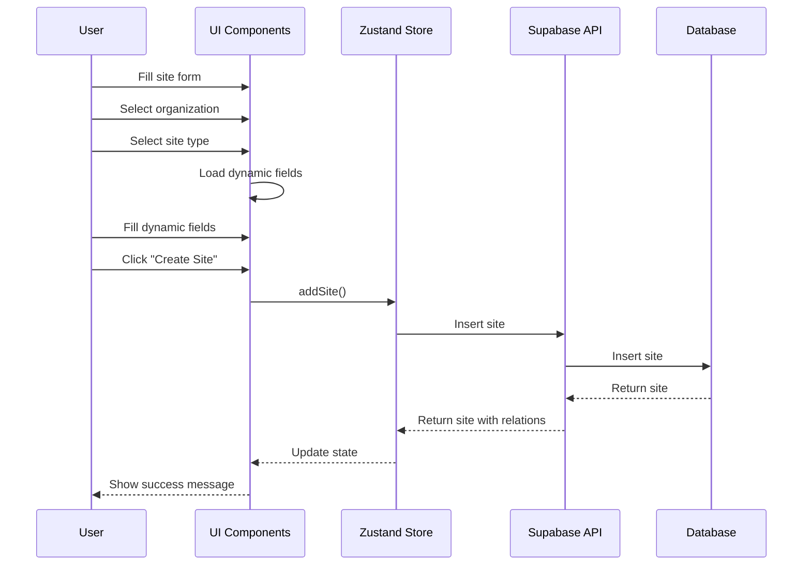
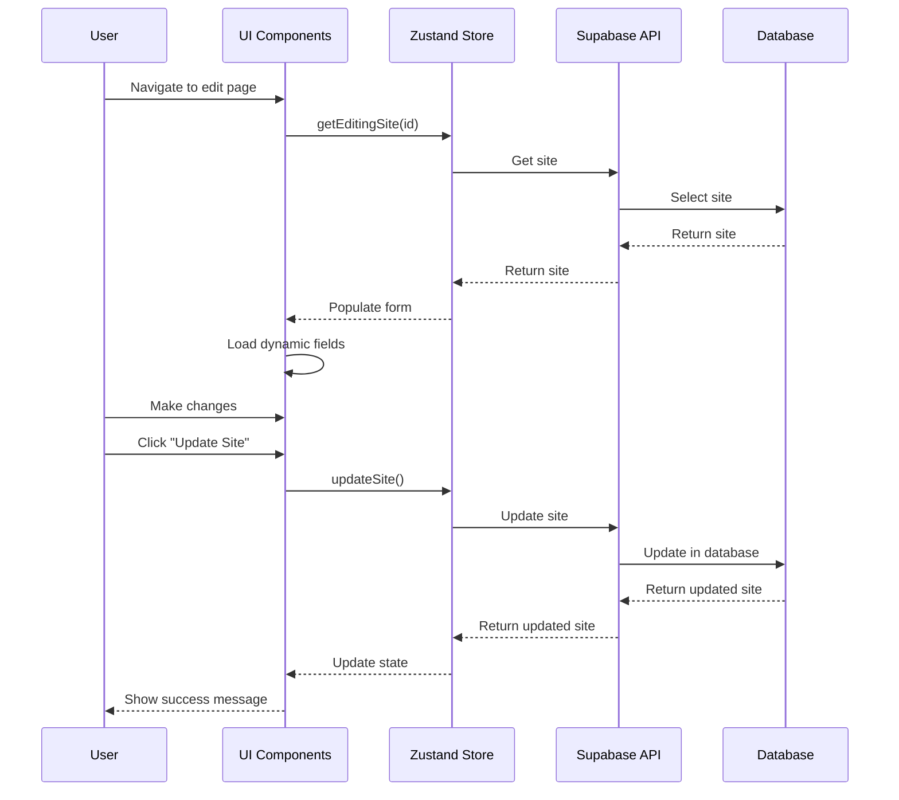

# Sites Implementation Plan

## Overview

This document outlines the implementation plan for the Sites management system, following the same pattern as the Product Management system. The Sites system allows administrators to create, read, update, and delete sites with associated addresses, organizations, and site types.

## Data Model

### Core Entities

1. **Site**
   ```typescript
   interface Site {
     id: string;
     name: string;
     data: Record<string, unknown>;
     organization_id: string;
     address_id?: string;
     site_type_id: string;
     site_type: SiteType;
     address?: Address;
   }
   ```

2. **SiteType**
   ```typescript
   interface SiteType {
     id: string;
     name: string;
     key: string;
     schema: Record<string, unknown>;
     managing_table: string;
   }
   ```

3. **Address** (shared with Delivery Locations)
   ```typescript
   interface Address {
     id: string;
     name: string;
     address: string;
     address1?: string;
     city: string;
     state: string;
     zip: string;
     latitude?: number;
     longitude?: number;
   }
   ```

4. **Organization**
   ```typescript
   interface Organization {
     id: string;
     name: string;
     description?: string;
     logo_url?: string;
     cover_url?: string;
     web_url?: string;
     organization_type_id: string;
     data?: Record<string, unknown>;
   }
   ```

## State Management

### Zustand Store

The Sites store will manage the state for sites:

```typescript
interface SiteState {
  sites: Site[];
  siteTypes: SiteType[];
  isLoading: boolean;
  error: Error | null;
  fetchSites: () => Promise<void>;
  fetchSiteTypes: () => Promise<void>;
  addSite: (site: Omit<Site, 'id' | 'site_type'>) => Promise<Site | null>;
  updateSite: (id: string, site: Partial<Site>) => Promise<Site | null>;
  deleteSite: (id: string) => Promise<void>;
  editingSite: EditingSite | null;
  setEditingSite: (site: EditingSite) => void;
  getEditingSite: (id: string) => EditingSite | null;
  createEditingSite: (site: Site) => EditingSite;
}

interface EditingSite {
  input: SiteInput;
  site: Site;
  is_dirty: boolean;
}

interface SiteInput {
  name: string;
  organization_id: string;
  site_type_id: string;
  address_id?: string;
  data: Record<string, unknown>;
}
```

## Component Structure

### Pages

1. **Sites List Page**
   - Path: `/sites`
   - Features:
     - Display all sites in a table
     - Filter and search functionality
     - Actions for edit and delete
     - Organization and type filtering

2. **Create Site Page**
   - Path: `/sites/create`
   - Features:
     - Form for entering site details
     - Organization selection
     - Site type selection
     - Address input with validation
     - Dynamic fields based on site type schema

3. **Edit Site Page**
   - Path: `/sites/edit/:id`
   - Features:
     - Pre-populated form with existing data
     - Organization and type editing
     - Address modification
     - Dynamic fields based on site type schema

### Components

1. **SitesTable**
   - Display sites in tabular format
   - Sorting and filtering capabilities
   - Action buttons for each row

2. **SiteForm**
   - Reusable form for creating and editing sites
   - Organization selection dropdown
   - Site type selection dropdown
   - Address input component
   - Dynamic form fields based on site type schema

3. **SiteDetails**
   - Display detailed information about a site
   - Organization information
   - Address details
   - Site type specific information

4. **SiteTypeFields**
   - Dynamic form fields based on site type schema
   - Validation based on schema requirements
   - Support for various field types (text, number, select, etc.)

## API Integration

### Supabase Queries

1. **Fetch Sites**
   ```typescript
   const { data, error } = await supabase
     .from('site')
     .select(`
       *,
       site_type(*),
       address(*)
     `)
     .order('name', { ascending: true });
   ```

2. **Add Site**
   ```typescript
   const { data, error } = await supabase
     .from('site')
     .insert(siteToInsert)
     .select(`
       *,
       site_type(*),
       address(*)
     `)
     .single();
   ```

3. **Update Site**
   ```typescript
   const { data, error } = await supabase
     .from('site')
     .update(siteToUpdate)
     .eq('id', id)
     .select(`
       *,
       site_type(*),
       address(*)
     `)
     .single();
   ```

4. **Delete Site**
   ```typescript
   const { error } = await supabase
     .from('site')
     .delete()
     .eq('id', id);
   ```

5. **Fetch Site Types**
   ```typescript
   const { data, error } = await supabase
     .from('site_type')
     .select('*')
     .order('name', { ascending: true });
   ```

## Form Validation

### Zod Schema

```typescript
export const siteSchema = z.object({
  name: z.string().min(1, { message: "Site name is required." }),
  organizationId: z.string().min(1, { message: "Organization is required." }),
  siteTypeId: z.string().min(1, { message: "Site type is required." }),
  addressId: z.string().optional(),
  data: z.record(z.unknown()).optional(),
});

// Dynamic schema based on site type
export const createDynamicSiteSchema = (siteTypeSchema: Record<string, unknown>) => {
  const baseSchema = siteSchema;
  const dynamicFields = {};
  
  // Parse the site type schema and create Zod validators
  Object.entries(siteTypeSchema).forEach(([key, field]) => {
    if (field.type === 'string') {
      dynamicFields[key] = field.required 
        ? z.string().min(1, { message: `${field.label} is required.` })
        : z.string().optional();
    } else if (field.type === 'number') {
      dynamicFields[key] = field.required
        ? z.number({ message: `${field.label} must be a number.` })
        : z.number().optional();
    }
    // Add more field types as needed
  });
  
  return baseSchema.extend({
    dynamicFields: z.object(dynamicFields),
  });
};
```

## Implementation Steps

### 1. Setup Data Models and Validation (1 day)
- Define TypeScript interfaces for all entities
- Create Zod validation schemas
- Set up type definitions for Supabase tables

### 2. Implement State Management (1 day)
- Create Zustand store for sites
- Implement CRUD operations in the store
- Add error handling and loading states
- Implement dynamic schema handling

### 3. Build UI Components (2 days)
- Create reusable form components
- Implement table view
- Build dynamic form fields component
- Create site details component

### 4. Develop Pages (2 days)
- Create list page with table
- Implement create and edit pages
- Add navigation and routing
- Implement dynamic form rendering based on site type

### 5. Add Organization Integration (1 day)
- Implement organization selection
- Add organization details display
- Handle organization-specific validation

### 6. Testing and Refinement (1 day)
- Test all CRUD operations
- Verify form validation
- Ensure responsive design
- Test with various site types

## Flow Diagrams

### Create Site Flow



### Edit Site Flow



## Dynamic Form Rendering

The site management system will support dynamic form fields based on the site type schema. This allows for flexible data collection specific to each site type.

### Site Type Schema Example

```json
{
  "capacity": {
    "type": "number",
    "label": "Capacity",
    "required": true,
    "min": 1
  },
  "operatingHours": {
    "type": "string",
    "label": "Operating Hours",
    "required": true
  },
  "amenities": {
    "type": "array",
    "label": "Amenities",
    "required": false,
    "items": {
      "type": "string"
    }
  }
}
```

### Dynamic Form Rendering Process

1. Fetch site type schema from the database
2. Parse schema to generate form fields
3. Create dynamic validation schema
4. Render appropriate form components
5. Validate input against dynamic schema
6. Store data in the `data` field of the site

## Conclusion

This implementation plan provides a comprehensive approach to building the Sites management system following the same patterns as the Product Management system. The plan includes support for dynamic form fields based on site types, allowing for flexible and extensible site management.