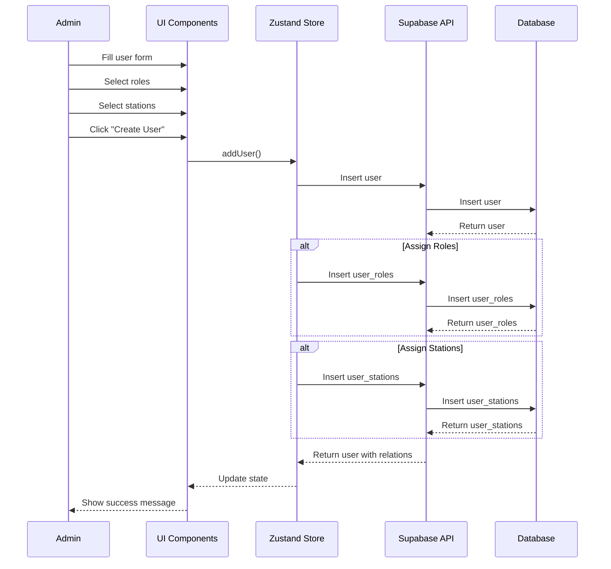
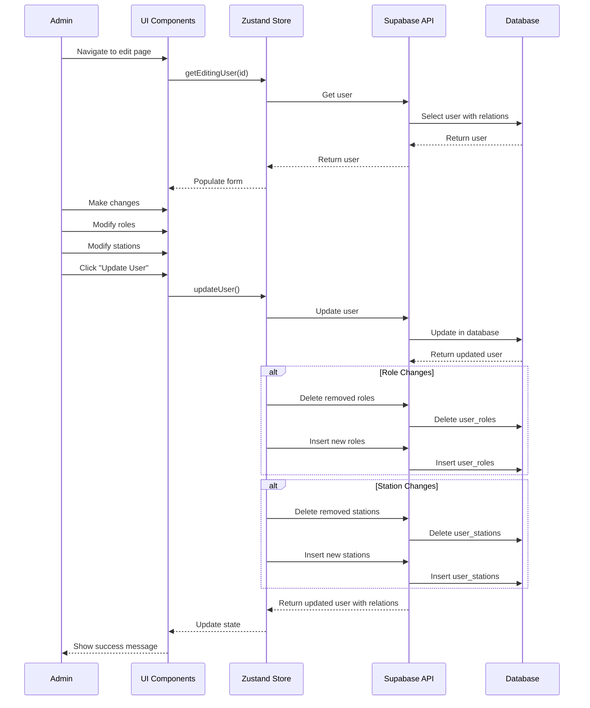

# Users Implementation Plan

## Overview

This document outlines the implementation plan for the Users management system, following the same pattern as the Product Management system. The Users system allows administrators to create, read, update, and delete user accounts, manage roles and permissions, and associate users with stations.

## Data Model

### Core Entities

1. **User**
   ```typescript
   interface User {
     id: string;
     email: string;
     first_name: string;
     last_name: string;
     handle: string;
     did: string;
     pds_url: string;
     phone_number?: string;
     primary_station_id?: string;
     stripe_customer_id?: string;
     metadata?: Record<string, unknown>;
     created_at: string;
     updated_at?: string;
     roles?: Role[];
     stations?: Station[];
   }
   ```

2. **Role**
   ```typescript
   interface Role {
     id: string;
     name: string;
     key: string;
     description?: string;
     permissions: Permission[];
   }
   ```

3. **Permission**
   ```typescript
   interface Permission {
     id: string;
     name: string;
     key: string;
     metadata?: Record<string, unknown>;
   }
   ```

4. **Station**
   ```typescript
   interface Station {
     id: string;
     name: string;
     site_id: string;
     station_type_id: string;
   }
   ```

5. **UserRole**
   ```typescript
   interface UserRole {
     id: string;
     user_id: string;
     role_id: string;
     created_at: string;
   }
   ```

6. **UserStation**
   ```typescript
   interface UserStation {
     id: string;
     user_id: string;
     station_id: string;
     created_at: string;
   }
   ```

## State Management

### Zustand Store

The Users store will manage the state for users:

```typescript
interface UserStoreState {
  users: User[];
  roles: Role[];
  permissions: Permission[];
  stations: Station[];
  isLoading: boolean;
  error: Error | null;
  fetchUsers: () => Promise<void>;
  fetchRoles: () => Promise<void>;
  fetchPermissions: () => Promise<void>;
  fetchStations: () => Promise<void>;
  addUser: (user: UserInput) => Promise<User | null>;
  updateUser: (id: string, user: Partial<UserInput>) => Promise<User | null>;
  deleteUser: (id: string) => Promise<void>;
  assignRole: (userId: string, roleId: string) => Promise<void>;
  removeRole: (userId: string, roleId: string) => Promise<void>;
  assignStation: (userId: string, stationId: string) => Promise<void>;
  removeStation: (userId: string, stationId: string) => Promise<void>;
  editingUser: EditingUser | null;
  setEditingUser: (user: EditingUser) => void;
  getEditingUser: (id: string) => EditingUser | null;
  createEditingUser: (user: User) => EditingUser;
}

interface EditingUser {
  input: UserInput;
  user: User;
  is_dirty: boolean;
}

interface UserInput {
  email: string;
  first_name: string;
  last_name: string;
  handle: string;
  did: string;
  pds_url: string;
  phone_number?: string;
  primary_station_id?: string;
  metadata?: Record<string, unknown>;
}
```

## Component Structure

### Pages

1. **Users List Page**
   - Path: `/users`
   - Features:
     - Display all users in a table
     - Filter and search functionality
     - Role and station filtering
     - Actions for edit and delete

2. **Create User Page**
   - Path: `/users/create`
   - Features:
     - Form for entering user details
     - Role assignment
     - Station assignment
     - Validation for required fields

3. **Edit User Page**
   - Path: `/users/edit/:id`
   - Features:
     - Pre-populated form with existing data
     - Role management
     - Station management
     - Password reset option

4. **User Profile Page**
   - Path: `/users/profile/:id`
   - Features:
     - Detailed user information
     - Role and permission display
     - Station assignments
     - Activity history

### Components

1. **UsersTable**
   - Display users in tabular format
   - Sorting and filtering capabilities
   - Action buttons for each row
   - Role and station indicators

2. **UserForm**
   - Reusable form for creating and editing users
   - Validation for all fields
   - Role selection component
   - Station selection component

3. **RoleManager**
   - Interface for assigning and removing roles
   - Permission visualization
   - Role conflict detection

4. **StationManager**
   - Interface for assigning and removing stations
   - Primary station selection
   - Site grouping for stations

## API Integration

### Supabase Queries

1. **Fetch Users**
   ```typescript
   const { data, error } = await supabase
     .from('users')
     .select(`
       *,
       user_roles(
         *,
         roles(*)
       ),
       user_stations(
         *,
         stations(*)
       )
     `)
     .order('last_name', { ascending: true });
   ```

2. **Add User**
   ```typescript
   const { data, error } = await supabase
     .from('users')
     .insert(userToInsert)
     .select()
     .single();
   ```

3. **Update User**
   ```typescript
   const { data, error } = await supabase
     .from('users')
     .update(userToUpdate)
     .eq('id', id)
     .select()
     .single();
   ```

4. **Delete User**
   ```typescript
   const { error } = await supabase
     .from('users')
     .delete()
     .eq('id', id);
   ```

5. **Assign Role**
   ```typescript
   const { data, error } = await supabase
     .from('user_roles')
     .insert({
       user_id: userId,
       role_id: roleId,
     })
     .select();
   ```

6. **Remove Role**
   ```typescript
   const { error } = await supabase
     .from('user_roles')
     .delete()
     .eq('user_id', userId)
     .eq('role_id', roleId);
   ```

7. **Assign Station**
   ```typescript
   const { data, error } = await supabase
     .from('user_stations')
     .insert({
       user_id: userId,
       station_id: stationId,
     })
     .select();
   ```

8. **Remove Station**
   ```typescript
   const { error } = await supabase
     .from('user_stations')
     .delete()
     .eq('user_id', userId)
     .eq('station_id', stationId);
   ```

## Form Validation

### Zod Schema

```typescript
export const userSchema = z.object({
  email: z.string().email({ message: "Invalid email address." }),
  firstName: z.string().min(1, { message: "First name is required." }),
  lastName: z.string().min(1, { message: "Last name is required." }),
  handle: z.string().min(1, { message: "Handle is required." }),
  did: z.string().min(1, { message: "DID is required." }),
  pdsUrl: z.string().url({ message: "PDS URL must be a valid URL." }),
  phoneNumber: z.string().optional(),
  primaryStationId: z.string().optional(),
  metadata: z.record(z.unknown()).optional(),
});

export const roleAssignmentSchema = z.object({
  userId: z.string().min(1, { message: "User ID is required." }),
  roleId: z.string().min(1, { message: "Role ID is required." }),
});

export const stationAssignmentSchema = z.object({
  userId: z.string().min(1, { message: "User ID is required." }),
  stationId: z.string().min(1, { message: "Station ID is required." }),
});
```

## Implementation Steps

### 1. Setup Data Models and Validation (1 day)
- Define TypeScript interfaces for all entities
- Create Zod validation schemas
- Set up type definitions for Supabase tables

### 2. Implement State Management (2 days)
- Create Zustand store for users
- Implement CRUD operations in the store
- Add role and station management functions
- Add error handling and loading states

### 3. Build UI Components (2 days)
- Create reusable form components
- Implement table view
- Build role and station management components
- Create user profile component

### 4. Develop Pages (2 days)
- Create list page with table
- Implement create and edit pages
- Add user profile page
- Add navigation and routing

### 5. Add Role and Permission System (1 day)
- Implement role assignment interface
- Add permission visualization
- Create role-based access control

### 6. Add Station Management (1 day)
- Implement station assignment interface
- Add primary station selection
- Create station grouping by site

### 7. Testing and Refinement (1 day)
- Test all CRUD operations
- Verify form validation
- Test role and permission system
- Ensure responsive design

## Flow Diagrams

### Create User Flow



### Edit User Flow



## Role-Based Access Control

The user management system will implement role-based access control (RBAC) to manage permissions:

1. **Roles**: Collections of permissions (e.g., Admin, Manager, Staff)
2. **Permissions**: Granular access rights (e.g., create_user, edit_product)
3. **User-Role Assignment**: Users can have multiple roles
4. **Permission Checking**: UI and API will check permissions before allowing actions

### Permission Check Implementation

```typescript
// Check if user has permission
const hasPermission = (user: User, permissionKey: string): boolean => {
  if (!user.roles) return false;
  
  return user.roles.some(role => 
    role.permissions.some(permission => permission.key === permissionKey)
  );
};

// UI component with permission check
const ProtectedButton = ({ permissionKey, children, ...props }) => {
  const { currentUser } = useAuth();
  
  if (!hasPermission(currentUser, permissionKey)) {
    return null;
  }
  
  return <Button {...props}>{children}</Button>;
};
```

## Conclusion

This implementation plan provides a comprehensive approach to building the Users management system following the same patterns as the Product Management system. The plan includes role-based access control and station management, allowing for flexible user administration and security.